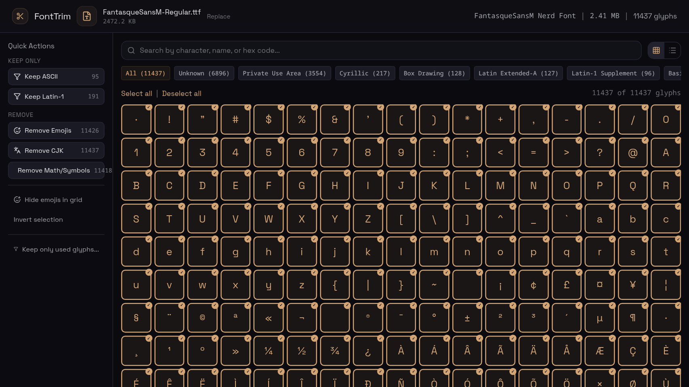
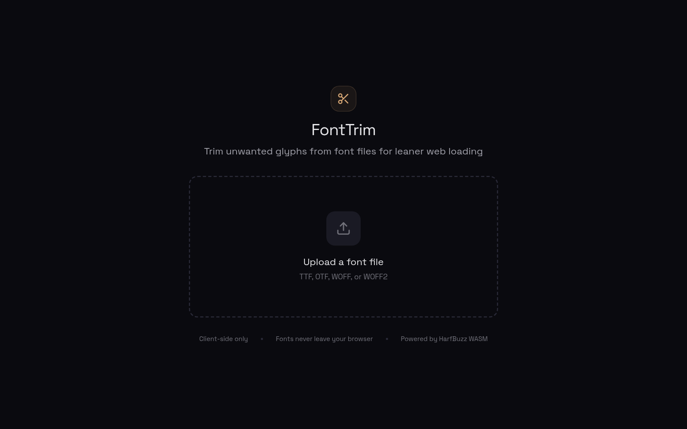
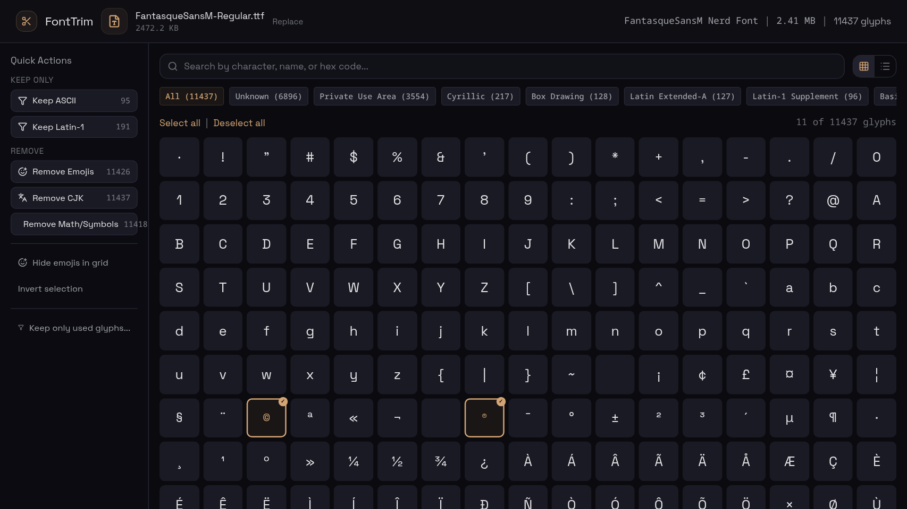

<p align="center"></p>

# FontTrim

Trim unwanted glyphs from font files for leaner web loading.



FontTrim is a browser-based tool that lets you inspect every glyph in a font file, pick exactly the characters you need, and export a smaller subset — no server, no uploads, no privacy concerns. Subsetting runs entirely client-side using [HarfBuzz](https://harfbuzz.github.io/) compiled to WASM.

## Features

- **Glyph browser** — Grid and list views with per-glyph metadata (codepoint, name, Unicode category)
- **Category filtering** — Filter by Unicode block (Latin, CJK, Cyrillic, Arabic, etc.)
- **Quick presets** — One-click "Keep ASCII only", "Keep Latin-1", "Remove emojis", "Remove CJK", "Remove math/symbols"
- **Detect from text** — Paste your content and FontTrim selects only the glyphs it uses
- **Live preview** — Type any text and see it rendered in the loaded font at any size
- **Size estimation** — See original vs. trimmed size and glyph counts before downloading
- **Privacy first** — Font data never leaves your browser; all processing is local via WASM
- **Dark UI** — Focused, low-distraction interface built for long glyph-selection sessions

## Screenshots

### Upload

Drop a `.ttf`, `.otf`, `.woff`, or `.woff2` file to get started.



### Editor

Browse glyphs, filter by category, toggle selection, preview the font, and download the trimmed file.


After applying presets (e.g. "Remove Emojis") the saved size is shown in real time:



## Getting Started

### Prerequisites

- [Node.js](https://nodejs.org/) ≥ 18
- [Bun](https://bun.sh/) (or npm/pnpm — adjust commands accordingly)

### Install

```bash
git clone https://github.com/zeon256/font-trim.git
cd font-trim
bun install
```

### Development

```bash
bun run dev
```

Opens at `http://localhost:5173`.

### Build

```bash
bun run build
```

Output goes to `dist/`. Deploy it anywhere that serves static files — no server runtime needed.

## How It Works

1. **Parse** — `opentype.js` extracts glyph metadata (codepoints, names, paths, metrics).
2. **Browse & select** — The UI renders each glyph as a toggleable cell. Quick-action presets and text-detection help narrow selection.
3. **Subset** — When you hit *Download*, the selected codepoints are sent to HarfBuzz WASM, which produces a conformant subsetted OpenType font.
4. **Download** — The trimmed `.ttf` is saved directly to disk.

## Tech Stack

| Layer | Library |
|-------|---------|
| UI | React 19, Tailwind CSS 4 |
| Font parsing | [opentype.js](https://opentype.js.org/) |
| Font subsetting | [hb-subset-wasm](https://github.com/nicktomlin/hb-subset-wasm) (HarfBuzz → WASM) |
| Build | Vite, TypeScript |

## License

Licensed under either of [Apache License, Version 2.0](LICENSE-APACHE) or [MIT License](LICENSE-MIT) at your option.
